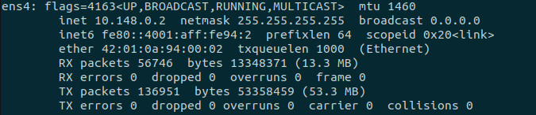
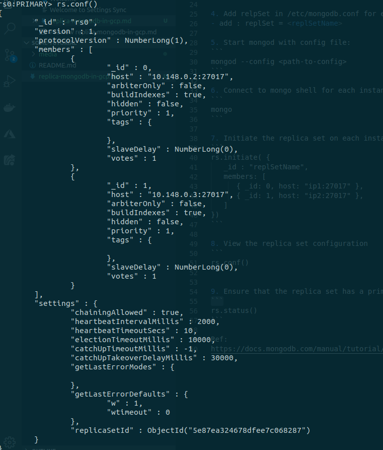
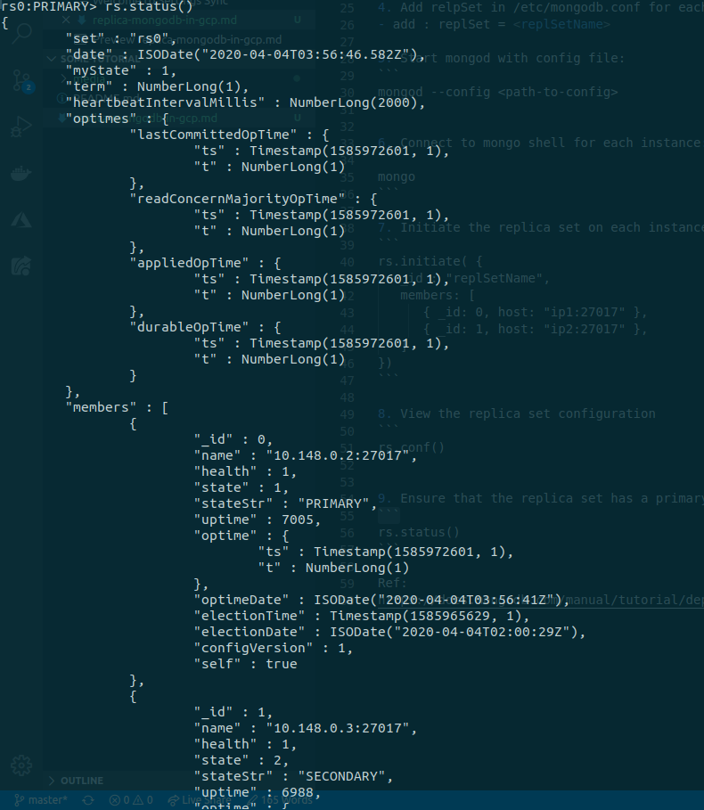

# Replica mongodb config in 2 computer enginee of GCP
1. bind_ip to 0.0.0.0:
```
sudo nano /etc/mongodb.conf
```
- Change ip localhost: 127.0.0.1 -> 0.0.0.0

2. Using ip internal of each instance to connect:
- get ip internal:
  ```
    ifconfig
  ```
  

3. Check connect to each instance
- Instance 1: check connect to instance 2
  ```
  mongo --host <ip-instance2>
  ```
- Instance 2: check connect to instance 3
  ```
  mongo --host <ip-instance1>
  ```

4. Add relpSet in /etc/mongodb.conf for each instance:
- add : replSet = <replSetName>

5. Start mongod with config file:
```
mongod --config <path-to-config>
```

6. Connect to mongo shell for each instance:
```
mongo
```

7. Initiate the replica set on each instance:
```
rs.initiate( {
   _id : "replSetName",
   members: [
      { _id: 0, host: "ip1:27017" },
      { _id: 1, host: "ip2:27017" },
   ]
})
```

8. View the replica set configuration
```
rs.conf()
```


9. Ensure that the replica set has a primary
```
rs.status()
```


Ref: 
https://docs.mongodb.com/manual/tutorial/deploy-replica-set/